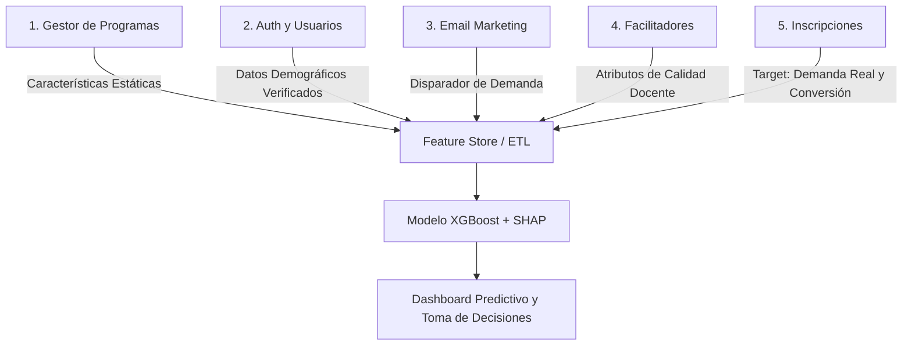

# Arquitectura del Sistema, Módulos y Base de Datos

**Academia Autopoiesis Certum Software**  
**Ecosistema:** Sistema Web Predictivo y de Gestión Académica  
**Estándar:** Arquitectura Empresarial Normalizada (3NF) & Feature Pipeline  

---

## 📑 Tabla de Contenidos
1. [Visión General del Ecosistema](#1-visión-general-del-ecosistema)
2. [Arquitectura de Base de Datos Orientada a ML](#2-arquitectura-de-base-de-datos-orientada-a-ml)
   - [Fundamentos de Normalización (1NF, 2NF, 3NF)](#21-fundamentos-de-normalización)
   - [Decisiones de Diseño Críticas para ML (SCD Tipo 2 y Aislamiento)](#22-decisiones-de-diseño-críticas-para-ml)
   - [Tratamiento de Ruido y Categorías](#23-tratamiento-de-ruido-y-categorías)
3. [Catálogo Integral de Módulos Funcionales](#3-catálogo-integral-de-módulos-funcionales)
   - [Módulo 1: Gestión de Programas Académicos](#31-módulo-gestión-de-programas-académicos)
   - [Módulo 2: Autenticación, Usuarios y Seguridad (2FA)](#32-módulo-autenticación-usuarios-y-seguridad-2fa)
   - [Módulo 3: Email Marketing y Gestión de Campañas (Mailing)](#33-módulo-email-marketing-y-gestión-de-campañas-mailing)
   - [Módulo 4: Gestión de Facilitadores y Personal Docente](#34-módulo-gestión-de-facilitadores-y-personal-docente)
   - [Módulo 5: Inscripciones y Seguimiento de Ventas (Conversión)](#35-módulo-inscripciones-y-seguimiento-de-ventas-conversión)
4. [Flujo de Datos e Integración con el Pipeline Analítico](#4-flujo-de-datos-e-integración-con-el-pipeline-analítico)

---

## 1. Visión General del Ecosistema

**Academia Autopoiesis** es una plataforma integral containerizada diseñada para la gestión académica, captación de prospectos y pronóstico analítico de demanda mediante Inteligencia Artificial Explicable (XGBoost + SHAP).

### Stack Tecnológico Principal
* **Frontend:** React 19, React Router DOM 7, Recharts, Lucide React, Vite (Node 22 Alpine).
* **Backend:** Python (3.10+) / Flask 3.0, SQLAlchemy 2.0, PyJWT, Bcrypt, Flask-Mail, Gunicorn.
* **Base de Datos:** PostgreSQL (15+ Alpine) — Diseño normalizado para transaccionalidad OLTP y almacenamiento de features OLAP.
* **Inteligencia Artificial:** XGBoost 2.0+, SHAP 0.43+, Optuna 3.6+, Pandas, NumPy, Jupyter Lab 4.0.
* **Orquestación:** Docker & Docker Compose con volúmenes persistentes.

---

## 2. Arquitectura de Base de Datos Orientada a ML

El esquema de base de datos relacional (definido en `db/init/01_schema.sql` y `ml_tables.sql`) fue concebido con un doble propósito: asegurar una transaccionalidad robusta (OLTP) y proveer datos atómicos y estructurados para alimentar el pipeline de Machine Learning (XGBoost).

### 2.1. Fundamentos de Normalización

El esquema cumple estrictamente con las Formas Normales relacionales, evitando redundancias y anomalías:

#### Primera Forma Normal (1NF): Atomicidad
* *Principio:* Todos los atributos deben ser atómicos (indivisibles) y no deben existir grupos repetitivos.
* **Implementación:** En lugar de almacenar listas de facilitadores o beneficios en campos de texto delimitados por comas (ej. `"Facilitador A, Facilitador B"`), se implementaron tablas intermedias:
  - `programa_facilitadores`: Relación N:M entre `programas` y `usuarios` (facilitadores).
  - `programa_beneficios`: Relación N:M entre `programas` y `beneficios`.
* **Beneficio ML:** XGBoost no procesa cadenas compuestas nativamente. Tener relaciones N:M normalizadas permite derivar métricas exactas como `num_facilitadores` y `num_beneficios` por cohorte/programa sin parseo de texto.

#### Segunda Forma Normal (2NF): Dependencia Completa
* *Principio:* Todos los atributos no clave deben depender de la clave primaria completa.
* **Implementación:** Los datos demográficos y geográficos de los estudiantes (`departamentos`, `grados_academicos`) residen exclusivamente en la entidad `usuarios`. La tabla `inscripciones` solo registra el evento transaccional asociando `usuario_id` y `programa_id`.
* **Beneficio ML:** Permite aislar el perfil intrínseco del estudiante del evento de compra, facilitando la agregación demográfica semanal sin duplicar registros de usuario.

#### Tercera Forma Normal (3NF): Eliminación de Dependencias Transitivas
* *Principio:* No deben existir dependencias transitivas entre atributos no clave (todo atributo depende únicamente de la clave primaria).
* **Implementación:** Se definieron tablas de catálogo maestras:
  - `origenes_captacion` (Facebook, Boletín, Orgánico, Recomendación).
  - `estados_inscripcion` (Activo, Retirado, Finalizado, Pendiente).
  - `categorias` y `modalidades`.
* **Beneficio ML:** Evita el ruido por cardinalidad inconsistente (ej. variaciones tipográficas como `"FB"`, `"Face"`, `"Facebook"`). Garantiza categorías cerradas y finitas, condición crítica para la codificación One-Hot en el preprocesamiento de ML.

---

### 2.2. Decisiones de Diseño Críticas para ML

#### A. Congelamiento del Costo (`costo_pagado` / `costo_real_bs`)
En teoría relacional pura, registrar el costo en `inscripciones` cuando ya existe `costo_oficial_bs` en `programas` podría parecer redundante. Sin embargo, constituye una **excepción de diseño obligatoria: Slowly Changing Dimensions (SCD Tipo 2 simplificado)**.
* **Justificación:** El precio de catálogo de un programa cambia con el tiempo (descuentos por pronto pago, inflación, becas). Si el sistema consultara siempre el precio actual, la información financiera histórica se corrompería.
* **Beneficio ML:** Permite computar la **tasa de descuento real** (`tasa_descuento = (costo_oficial_bs - costo_pagado) / costo_oficial_bs`) y la **elasticidad del precio**, dos de las variables predictivas más sensibles para XGBoost.

#### B. Aislamiento Financiero (`pagos`)
El sistema desacopla el acto académico (`inscripciones`) del flujo monetario (`pagos` en cuotas o diferidos).
* **Beneficio ML:** Permite construir análisis de series de tiempo de pagos para proyectar riesgo de abandono (*churn*), detectando que estudiantes con pagos retrasados tienen mayor probabilidad de transición al estado "Retirado".

#### C. Integridad Histórica mediante Borrado Lógico (*Soft Deletion*)
* **Directiva:** Queda estrictamente prohibido ejecutar `DELETE` físico sobre programas, usuarios o inscripciones históricas.
* **Implementación:** Se utilizan banderas booleanas (`eliminado = true`, `activo = false`).
* **Justificación ML:** Mantener los registros históricos inmutables evita distorsiones matemáticas y sesgos de selección en las series temporales que alimentan el Feature Store.

---

### 2.3. Tratamiento de Ruido y Categorías

* **Eliminación de la categoría "Otro":** Los datos geográficos se estructuran exclusivamente en los 9 departamentos de Bolivia más la opción "Extranjero". Esto previene que "Otro" funcione como basurero estadístico, reduciendo la varianza no explicada del modelo.
* **Separación de Capas:** El Feature Store analítico (`caracteristicas_demanda_semanal`) y la tabla de resultados (`predicciones`) operan como Data Marts desacoplados sobre el núcleo transaccional, aislando la carga computacional de inferencia.

---

## 3. Catálogo Integral de Módulos Funcionales

Cada módulo de la aplicación cumple una función operativa y a la vez actúa como generador o consumidor de características para el modelo predictivo.

---

### 3.1. Módulo: Gestión de Programas Académicos
* **Ubicación Frontend:** `frontend/src/pages/dashboard/GestorProgramas.jsx`
* **Rol en ML:** Fuente primaria de **características estáticas (Static Features)**. Cada programa registrado actúa como una entidad base para la inferencia de demanda.

#### Mapeo de Variables para XGBoost
| Campo Capturado | Transformación en ML | Impacto en la Predicción |
| :--- | :--- | :--- |
| **Categoría** | One-Hot Encoding | Identifica nichos de mercado con mayor o menor demanda (ej. Derecho vs. Grafología). |
| **Tipo de Servicio** | Binario / One-Hot | Diferencia cursos cortos (alta rotación) de diplomados (alta especialización y menor cohorte). |
| **Modalidad** | One-Hot Encoding | Evalúa la preferencia del mercado (Virtual vs. Presencial vs. Híbrido). |
| **Costo Oficial (Bs.)** | Variable Numérica Continua | Modela la **elasticidad del precio** sobre la intención de compra. |
| **Fechas (Inicio/Fin)** | Extracción Cíclica | Genera `seno_mes`, `coseno_mes`, `seno_semana`, `coseno_semana` para captar estacionalidad. |
| **Duración (Horas)** | Variable Numérica | Mide la intensidad formativa y el compromiso temporal requerido. |
| **Beneficios Asociados** | Conteo Numérico / Multi-Hot | Evalúa el impacto de incentivos de valor (grabaciones, bibliotecas virtuales, mentorías). |

---

### 3.2. Módulo: Autenticación, Usuarios y Seguridad (2FA)
* **Ubicación Frontend:** `frontend/src/pages/` (`Registro.jsx`, `Login.jsx`, `VerificarEmail.jsx`, `ResetPassword.jsx`)
* **Rol en ML:** Ingesta de **características demográficas (User Features)** y garantía de calidad de datos mediante filtrado de cuentas no válidas.

#### Variables y Control de Calidad
| Funcionalidad | Impacto en Calidad de Datos | Valor para el Modelo Predictivo |
| :--- | :--- | :--- |
| **Validación de Edad** | Control de audiencia (rango válido) | Evita registros fuera del público objetivo legal y profesional. |
| **Verificación de Email** | Flag booleano (`verificado = true`) | **Filtro de Entrenamiento:** El pipeline omite cuentas no verificadas para evitar distorsiones por bots o registros abandonados. |
| **Grado Académico / Ocupación** | Categorización profesional | Variable de entrada que ayuda a predecir la afinidad entre perfil del alumno y complejidad del programa. |
| **Seguridad 2FA (TOTP)** | Persistencia de identidad | Asegura que el historial de interacciones provenga del usuario legítimo, mejorando la trazabilidad. |

---

### 3.3. Módulo: Email Marketing y Gestión de Campañas (Mailing)
* **Ubicación Frontend:** `frontend/src/pages/dashboard/Mailing.jsx`
* **Rol en ML:** **Disparador de demanda (Demand Driver)**. Registra las intervenciones publicitarias para contextualizar picos de ventas.

#### Aporte al Ciclo Predictivo
* **Boletines Informativos:** Generan picos temporales de inscripción que deben ser modelados mediante canales de captación para evitar atribuirlos únicamente a demanda orgánica.
* **Material Gráfico / Flyers:** Incrementan la tasa de conversión (CTR), acelerando la velocidad de matriculación semanal.
* **Gestión de Preferencias (Opt-in):** Asegura que los análisis de captación se basen en usuarios con intención de compra activa.

---

### 3.4. Módulo: Gestión de Facilitadores y Personal Docente
* **Ubicación Frontend:** `frontend/src/pages/dashboard/GestorFacilitadores.jsx`
* **Rol en ML:** Variable de influencia indirecta sobre la reputación y calidad del programa académico.

#### Variables para el Modelo
* **Número de Facilitadores (`num_facilitadores`):** Indica la envergadura del equipo docente asignado a la cohorte.
* **Especialidad y Perfil:** Permite correlacionar perfiles técnicos/prácticos con mayores tasas de finalización e inscripciones.

---

### 3.5. Módulo: Inscripciones y Seguimiento de Ventas (Conversión)
* **Ubicación Frontend:** `frontend/src/pages/dashboard/Inscripciones.jsx`, `NuevaInscripcion.jsx`
* **Rol en ML:** **Generación de la Variable Objetivo (Target / Labeling)**. Registra las conversiones reales que el modelo predice.

#### Variables Críticas
* **Conteo de Demanda (`conteo_demanda`):** Agregación de inscripciones efectivas por cohorte/semana. Constituye el Target del modelo de regresión.
* **Origen de Captación (`origen_id`):** Facebook, Boletín, Orgánico, Recomendación. Permite al modelo ponderar qué canal impulsa cada categoría temática.
* **Estado de la Inscripción:** Permite filtrar exclusivamente inscripciones confirmadas para evitar distorsiones por prospectos cancelados.
* **Costo Pagado Real:** Proporciona la base de cálculo de ingresos reales y descuentos aplicados.

---

## 4. Flujo de Datos e Integración con el Pipeline Analítico

1. **Captura:** El usuario o administrador interactúa con los módulos de frontend vía `fetchApi` (con cookies seguras HTTP-Only).
2. **Persistencia OLTP:** Flask API valida las reglas de negocio y persiste los registros en PostgreSQL bajo esquema normalizado (1NF a 3NF).
3. **ETL y Feature Store:** El pipeline (`train_model.py`) ejecuta consultas agregadas, integra métricas externas (GA4, Google Trends) y construye la tabla `caracteristicas_demanda_semanal`.
4. **Entrenamiento e Inferencia:** XGBoost optimizado por Optuna calcula las proyecciones y SHAP genera las contribuciones aditivas locales y globales.
5. **Consumo:** El administrador visualiza las predicciones, intervalos de confianza y explicaciones en el Dashboard (`IAPredictiva.jsx`, `FichaTecnicaModelo.jsx`).
