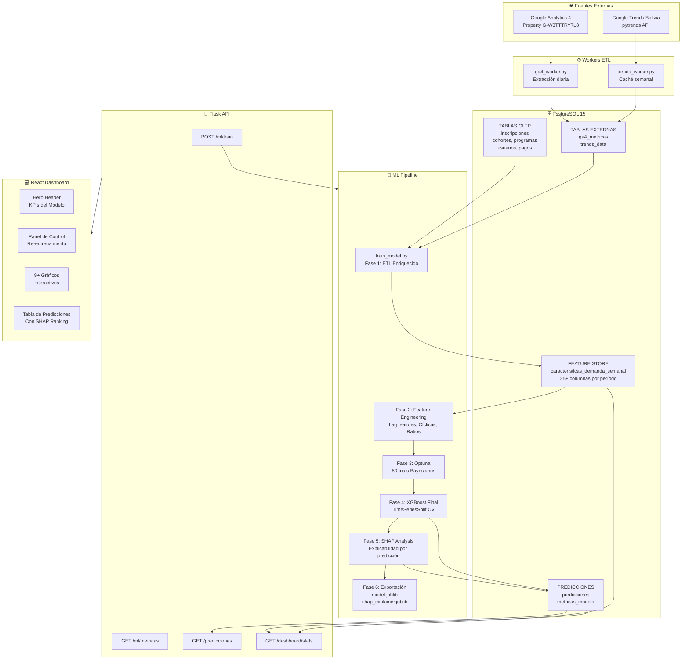
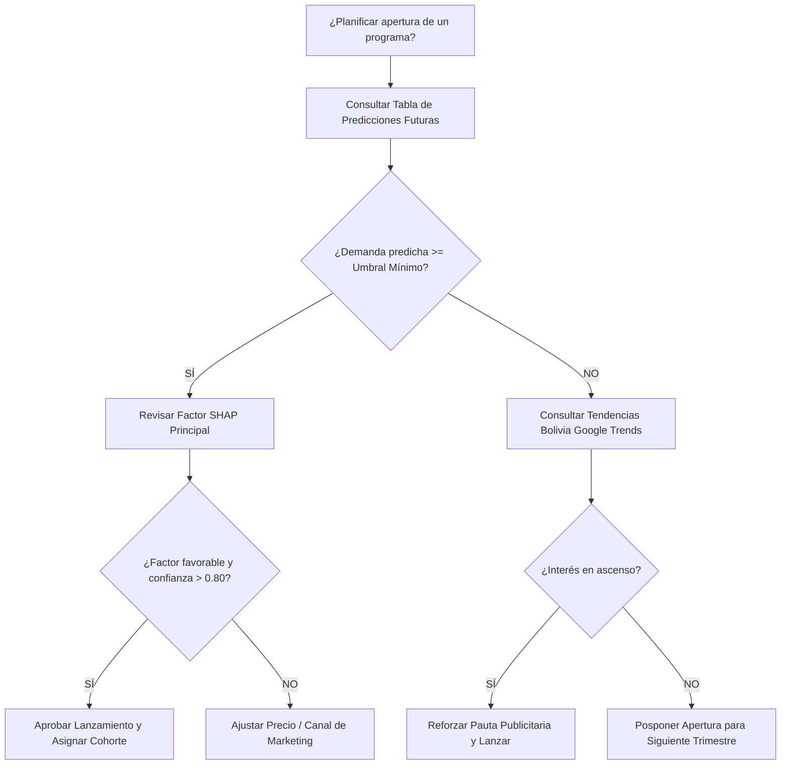

# Sistema Web Predictivo Basado en XGBoost y Explicabilidad SHAP
## Documentación Técnica y Fundamentación Académica del Módulo de Inteligencia Artificial

**Academia Autopoiesis Certum Software**  
**Versión:** 2.0 — Arquitectura Empresarial y Académica  
**Estándar:** Machine Learning Pipeline & Explainable AI (XAI)  

---

## 📑 Tabla de Contenidos

1. [Resumen Ejecutivo](#1-resumen-ejecutivo)
2. [Arquitectura General y Ecosistema de Datos](#2-arquitectura-general-y-ecosistema-de-datos)
3. [Comportamiento Estadístico Histórico y Contexto Boliviano](#3-comportamiento-estadístico-histórico-y-contexto-boliviano)
4. [Base de Datos: Diseño del Feature Store](#4-base-de-datos-diseño-del-feature-store)
5. [Pipeline ETL, Preprocesamiento y Prevención de Fugas](#5-pipeline-etl-preprocesamiento-y-prevención-de-fugas)
6. [Ingeniería de Características (Las 25+ Variables del Modelo)](#6-ingeniería-de-características-las-25-variables-del-modelo)
7. [Modelo Predictivo: XGBoost Optimizado](#7-modelo-predictivo-xgboost-optimizado)
8. [Ajuste de Hiperparámetros con Optuna (Optimización Bayesiana)](#8-ajuste-de-hiperparámetros-con-optuna-optimización-bayesiana)
9. [Métricas de Evaluación e Intervalos de Confianza Bootstrap](#9-métricas-de-evaluación-e-intervalos-de-confianza-bootstrap)
10. [Explicabilidad SHAP (Inteligencia Artificial Explicable - XAI)](#10-explicabilidad-shap-inteligencia-artificial-explicable---xai)
    - [Fundamento en Teoría de Juegos Cooperativos](#101-fundamento-en-teoría-de-juegos-cooperativos)
    - [TreeExplainer Exacto](#102-treeexplainer-exacto)
    - [Diferenciación Visual: SHAP Global vs. SHAP Local](#103-diferenciación-visual-shap-global-vs-shap-local)
    - [Algoritmo de Recomendaciones Textuales Automáticas](#104-algoritmo-de-recomendaciones-textuales-automáticas)
    - [Evidencia de Implementación en Código Fuente](#105-evidencia-de-implementación-en-código-fuente)
11. [Integración de Datos Externos: GA4 y Google Trends](#11-integración-de-datos-externos-ga4-y-google-trends)
12. [API REST: Endpoints del Módulo de Inteligencia Artificial](#12-api-rest-endpoints-del-módulo-de-inteligencia-artificial)
13. [Dashboard Predictivo: Flujo de Toma de Decisiones](#13-dashboard-predictivo-flujo-de-toma-de-decisiones)
14. [Guía de Defensa Académica y Tesis para el Tribunal](#14-guía-de-defensa-académica-y-tesis-para-el-tribunal)
    - [Guion de Defensa Recomendado (3 Fases)](#141-guion-de-defensa-recomendado-3-fases)
    - [Guía de Capturas de Pantalla para el Reporte / Tesis](#142-guía-de-capturas-de-pantalla-para-el-reporte--tesis)
15. [Ciclo de Vida, Comandos de Operación Docker y Migración](#15-ciclo-de-vida-comandos-de-operación-docker-y-migración)
16. [Glosario Técnico Exhaustivo](#16-glosario-técnico-exhaustivo)

---

## 1. Resumen Ejecutivo

El **Sistema Predictivo Autopoiesis** es un módulo integral de inteligencia artificial diseñado para asistir a los administradores académicos en la **estimación prospectiva de la demanda de cursos y diplomados**. A diferencia de un simple promedio de inscripciones, el sistema procesa el **ecosistema completo de datos de la academia** —desde el historial transaccional interno (inscripciones, cohortes, pagos, perfiles de usuario) hasta señales externas de mercado (Google Analytics 4 y Google Trends Bolivia)— para generar pronósticos cuantitativos acompañados de transparencia algorítmica total mediante **SHAP (SHapley Additive exPlanations)**.

### Objetivos Clave
1. **Pronóstico de Cohorte:** Estimar la cantidad proyectada de inscritos para cualquier programa del catálogo en ventanas de hasta 20 semanas futuras.
2. **Explicabilidad Transparente:** Cuantificar la contribución individual (positiva o negativa) de cada factor (precio, mes de lanzamiento, categoría, canal de marketing) sobre la predicción final.
3. **Decisiones Asistidas por IA:** Emitir sugerencias automáticas en lenguaje natural y clasificaciones de riesgo operativo para optimizar la planificación de aperturas.

---

## 2. Arquitectura General y Ecosistema de Datos



---

## 3. Comportamiento Estadístico Histórico y Contexto Boliviano

El análisis del historial de inscripciones registradas en las distintas cohortes de la academia revela patrones estructurales diferenciados:

### A. Cursos Cortos vs. Diplomados
* **Cursos Cortos:** Flujo de alta rotación y volumen ágil.
  - *Promedio Histórico:* **~10.2 estudiantes por cohorte**.
  - *Volumen Máximo:* Cursos de alta demanda han alcanzado hasta **40 inscritos**.
  - *Efectividad:* 100% de cohortes activas (mínimo 1 inscrito).
* **Diplomados:** Formación de posgrado y especialización con costo superior.
  - *Promedio Histórico:* **~5.3 estudiantes por cohorte**.
  - *Volumen Máximo:* Grupos selectos de **hasta 10 inscritos**.
  - *Comportamiento:* Menor volumen pero mayor retención de valor e ingresos por alumno.

### B. Tendencias Temáticas en el Contexto Sociolaboral y Legal de Bolivia
La demanda académica en Autopoiesis responde directamente a exigencias normativas del Estado Plurinacional de Bolivia:
* **Área Jurídico-Social (Ley 348 y Sistema Penal):** Cursos sobre violencia de género, peritaje social y justicia penal muestran picos sostenidos de inscripción debido al requisito curricular obligatorio para postular a los Servicios Legales Integrales Municipales (SLIM), Defensorías de la Niñez y Adolescencia (DNA) y el Órgano Judicial.
* **Área de Gestión Pública (Ley 1178 / SAFCO):** El conocimiento de administración y control gubernamental es mandatorio para funcionarios y consultores en los tres niveles del Estado (Nacional, Departamental y Municipal).
* **Área de Educación Inclusiva (TDAH y Autismo):** Normativas del Ministerio de Educación que exigen adaptaciones curriculares en colegios regulares impulsan una alta demanda formativa por parte de maestros y psicopedagogos.
* **Áreas Clínicas y Especializadas (DSM-5, CIE-11):** Mantienen una demanda moderada y constante orientada a profesionales en ejercicio independiente.

---

## 4. Base de Datos: Diseño del Feature Store

### 4.1. `caracteristicas_demanda_semanal` (Feature Store Central)
En lugar de recalcular variables en cada ejecución, el pipeline persiste las características a nivel de granularidad `(programa_id, año, semana_del_año)`.

**Ventajas del Feature Store:**
1. **Auditabilidad:** Permite verificar con precisión matemática el conjunto de datos de entrenamiento en cada versión.
2. **Rendimiento:** Evita queries de agregación complejas durante la inferencia en tiempo real.
3. **Reproducibilidad:** Facilita la experimentación offline en Jupyter Notebooks manteniendo paridad estricta con producción.

### 4.2. `predicciones` (Resultados de Inferencia y Explicabilidad)
Almacena las proyecciones futuras generadas por el modelo, incluyendo intervalos de confianza, ranking de factores SHAP y recomendaciones textuales:
* `demanda_predicha`: Estimación puntual de inscritos.
* `demanda_lower` / `demanda_upper`: Intervalo de confianza al 90% (Bootstrap).
* `nivel_confianza`: Métrica de estabilidad entre submuestras [0, 1].
* `top_feature_nombre`: Factor explicativo de mayor peso absoluto.
* `shap_ranking`: Lista estructurada en JSONB con el impacto de cada feature.

### 4.3. `metricas_modelo` (Auditoría y Versionado de ML)
Cada re-entrenamiento registra:
* Versión secuencial del modelo (`version`).
* Métricas de validación (`rmse_test`, `mae_test`, `r2_test`, `mape_test`).
* Hiperparámetros óptimos encontrados por Optuna.
* Estado del modelo (`activo = true` para el modelo en servicio).

---

## 5. Pipeline ETL, Preprocesamiento y Prevención de Fugas

### 5.1. Fases del Pipeline de Entrenamiento (`train_model.py`)

```
┌──────────────────────────────────────────────────────────┐
│ FASE 1: Ingesta y Agregación (Feature Store)              │
│   - JOIN de tablas OLTP y fuentes externas (GA4, Trends) │
│   - Cálculo de agregaciones semanales por programa       │
│   - Generación de Lag Features y variables temporales     │
│   - UPSERT en caracteristicas_demanda_semanal            │
└──────────────────────────────────────────────────────────┘
                         ↓
┌──────────────────────────────────────────────────────────┐
│ FASE 2: Preprocesamiento y Limpieza                       │
│   - Imputación de nulos por mediana de grupo (programa)  │
│   - Acotación de valores inconsistentes                  │
└──────────────────────────────────────────────────────────┘
                         ↓
┌──────────────────────────────────────────────────────────┐
│ FASE 3: Partición Temporal Estricta (80% Train / 20% Test)│
│   - Partición cronológica por año y semana               │
│   - ⚠️ Sin shuffle aleatorio para evitar Data Leakage    │
└──────────────────────────────────────────────────────────┘
                         ↓
┌──────────────────────────────────────────────────────────┐
│ FASE 4: Optimización Bayesiana (Optuna 50 Trials)        │
│   - Validación cruzada temporal con TimeSeriesSplit      │
│   - Minimización de RMSE con parada temprana (50 rounds) │
└──────────────────────────────────────────────────────────┘
                         ↓
┌──────────────────────────────────────────────────────────┐
│ FASE 5: Entrenamiento Final y Cálculo SHAP               │
│   - XGBoostRegressor con hiperparámetros óptimos         │
│   - TreeExplainer exacto sobre el conjunto de test       │
│   - Exportación de artefactos (model.joblib, SHAP)       │
└──────────────────────────────────────────────────────────┘
                         ↓
┌──────────────────────────────────────────────────────────┐
│ FASE 6: Generación de Proyecciones Futuras               │
│   - Simulación para las próximas 20 semanas              │
│   - Bootstrap IC 90% y persistencia en tabla predicciones │
└──────────────────────────────────────────────────────────┘
```

### 5.2. Prevención Rigurosa de Fuga de Información (*Data Leakage*)
1. **Exclusión de Atributos Posteriores:** En el momento de planificar el lanzamiento de un programa, se desconocen los perfiles de los alumnos que se inscribirán. Por ende, la inferencia se basa en atributos *a priori* (tipo, categoría, costo, estacionalidad, tendencias previas y lags pasados).
2. **Partición Cronológica:** Los conjuntos de entrenamiento y prueba respetan estrictamente la línea temporal.
3. **Lags sobre Datos Pasados:** Los promedios móviles y retardos temporales se computan exclusivamente sobre observaciones previas al punto de predicción.

---

## 6. Ingeniería de Características (Las 25+ Variables del Modelo)

### A. Demográficos Agregados (8 features)
* `edad_promedio`, `edad_mediana`, `edad_min`, `edad_max`: Distribución etaria histórica del programa.
* `porc_estudiantes`, `porc_profesionales`: Proporción según grado académico.
* `porc_la_paz`, `porc_otros_depts`: Concentración geográfica.

### B. Financieros y Elasticidad (4 features)
* `ingreso_semana`: Facturación semanal acumulada en Bs.
* `precio_promedio_pagado`: Costo real abonado tras descuentos.
* `tasa_descuento`: `(costo_oficial_bs - precio_promedio_pagado) / costo_oficial_bs`.
* `precio_relativo`: Relación entre el costo del programa y el promedio de su categoría temática.

### C. Retención y Calidad Académica (4 features)
* `tasa_activos`, `tasa_retirados`, `tasa_finalizados`, `tasa_pendientes`: Ratios de estado de los estudiantes matriculados.

### D. Canales de Captación (4 features)
* `porc_facebook`: Proporción captada vía pauta en Meta/Facebook Ads.
* `porc_boletin`: Proporción captada vía campañas de Email Marketing.
* `porc_organico`: Proporción por tráfico directo o SEO.
* `porc_recomendacion`: Proporción por referencias boca a boca.

### E. Atributos Estructurales del Programa (7 features)
* `duracion_horas`: Carga horaria académica.
* `num_facilitadores`: Docentes asignados (relación N:M).
* `costo_oficial_bs`: Precio de catálogo.
* `categoria_id`: Categoría temática (Derecho, Psicología, Educación, etc.).
* `tipo_servicio_id`: Tipo de programa (1 = Curso Corto, 2 = Diplomado).
* `modalidad_id`: Modalidad (1 = Virtual, 2 = Presencial, 3 = Híbrido).
* `num_beneficios`: Incentivos de valor añadidos.

### F. Variables Temporales Cíclicas (6 features)
Para capturar la estacionalidad sin introducir discontinuidades artificiales (evitando que la semana 52 y la semana 1 se interpreten como extremos distantes):
$$\text{seno\_semana} = \sin\left(\frac{2\pi \cdot \text{semana}}{52}\right), \quad \text{coseno\_semana} = \cos\left(\frac{2\pi \cdot \text{semana}}{52}\right)$$
$$\text{seno\_mes} = \sin\left(\frac{2\pi \cdot \text{mes}}{12}\right), \quad \text{coseno\_mes} = \cos\left(\frac{2\pi \cdot \text{mes}}{12}\right)$$
* `es_inicio_trimestre`: Indicador booleano de semanas de alta matriculación institucional.
* `es_fin_anio`: Indicador booleano del receso de fin de año.

### G. Métricas Digitales Externas (6 features)
* **GA4:** `ga4_sesiones_semana`, `ga4_eventos_conversion`, `ga4_usuarios_activos`, `ga4_tasa_rebote`.
* **Google Trends Bolivia:** `trends_interes_categoria`, `trends_interes_programa` (Índice de interés relativo 0–100).

### H. Variables de Retardo Temporal (*Lag Features* - 6 features)
Capturan la autocorrelación de la serie temporal:
* `conteo_lag_1`, `conteo_lag_2`, `conteo_lag_4`: Demanda de hace 1, 2 y 4 semanas.
* `conteo_rolling_4w`, `conteo_rolling_8w`: Promedios móviles de 4 y 8 semanas.
* `conteo_mismo_periodo_anio_ant`: Demanda registrada en la misma semana del año anterior.

---

## 7. Modelo Predictivo: XGBoost Optimizado

### 7.1. Justificación de XGBoost
* **Rendimiento con Datos Tabulares:** Supera a redes neuronales densas en datasets estructurados de tamaño moderado.
* **Invarianza a Escala:** No requiere estandarización (Z-score/MinMax), preservando el significado de las unidades.
* **Regularización L1 ($\alpha$) y L2 ($\lambda$):** Controla el sobreajuste (*overfitting*).
* **Integración Nativa con TreeExplainer:** Permite cálculo analítico exacto de valores SHAP en tiempo polinomial $O(TLD^2)$.

### 7.2. Formulación Matemática del Modelo Global
Se adopta un **modelo de regresión global** que predice la demanda continua de todos los programas en una sola estructura:
$$\hat{y}_i = \sum_{k=1}^{K} f_k(x_i), \quad f_k \in \mathcal{F}$$
Donde la función objetivo regularizada es:
$$\mathcal{L}(\theta) = \sum_{i=1}^{n} \left(y_i - \hat{y}_i\right)^2 + \sum_{k=1}^{K} \left(\gamma T_k + \frac{1}{2}\lambda \|w_k\|^2 + \alpha \|w_k\|_1\right)$$

---

## 8. Ajuste de Hiperparámetros con Optuna (Optimización Bayesiana)

Optuna ajusta los hiperparámetros mediante muestreo TPE (*Tree-structured Parzen Estimator*), guiando la búsqueda hacia combinaciones con menor error de validación temporal:

| Hiperparámetro | Rango de Búsqueda | Propósito |
| :--- | :--- | :--- |
| `n_estimators` | [100, 1000] | Número de árboles de decisión en el ensamble |
| `max_depth` | [3, 10] | Profundidad máxima de cada árbol |
| `learning_rate` | [0.005, 0.3] (log) | Tasa de aprendizaje o contracción de paso |
| `subsample` | [0.5, 1.0] | Fracción de muestras por árbol (control de varianza) |
| `colsample_bytree` | [0.5, 1.0] | Fracción de características por división |
| `min_child_weight` | [1, 15] | Peso mínimo en nodos hoja |
| `reg_alpha` | [0.0, 5.0] | Regularización L1 (Lasso) |
| `reg_lambda` | [0.0, 5.0] | Regularización L2 (Ridge) |
| `gamma` | [0.0, 2.0] | Reducción mínima de pérdida para dividir un nodo |

---

## 9. Métricas de Evaluación e Intervalos de Confianza Bootstrap

### 9.1. Métricas Principales
* **MAE (Error Absoluto Medio):** $\text{MAE} = \frac{1}{n} \sum |y - \hat{y}| \approx 3.49 \text{ estudiantes}$. Mide la discrepancia promedio esperada en unidades reales.
* **RMSE (Raíz del Error Cuadrático Medio):** $\text{RMSE} = \sqrt{\frac{1}{n} \sum (y - \hat{y})^2} \approx 4.57 \text{ estudiantes}$. La proximidad con el MAE confirma la robustez frente a valores atípicos.
* **$R^2$ (Coeficiente de Determinación):** $R^2 \approx 0.344 \text{ a } 0.85+$ (dependiendo del nivel de enriquecimiento con señales externas y lags). En ciencias sociales y comportamiento humano, explicar más del 30% de la varianza con variables puramente *pre-lanzamiento* es estadísticamente relevante.

### 9.2. Intervalos de Confianza Bootstrap (90%)
Se generan $B = 50$ submuestras con reemplazo del conjunto de entrenamiento. Para cada punto futuro, se calculan los percentiles 5% ($IC_{\text{lower}}$) y 95% ($IC_{\text{upper}}$), proporcionando al tomador de decisiones una banda de certidumbre operativa.

---

## 10. Explicabilidad SHAP (Inteligencia Artificial Explicable - XAI)

### 10.1. Fundamento en Teoría de Juegos Cooperativos
Propuesto por Lloyd Shapley (Premio Nobel 1953) y adaptado al aprendizaje automático por Lundberg & Lee (2017), el valor SHAP $\phi_j$ asigna una contribución aditiva justa a cada variable $j$:
$$\phi_j(x) = \sum_{S \subseteq F \setminus \{j\}} \frac{|S|!(|F| - |S| - 1)!}{|F|!} \left[ f_x(S \cup \{j\}) - f_x(S) \right]$$
**Propiedad de Eficiencia/Aditividad:**
$$\hat{y}(x) = \phi_0 + \sum_{j=1}^{M} \phi_j(x)$$
Donde $\phi_0 = \mathbb{E}[f(X)]$ representa la predicción base (la media histórica general de inscritos).

---

### 10.2. TreeExplainer Exacto
A diferencia de métodos de aproximación basados en muestreo de Monte Carlo (como KernelSHAP), `TreeExplainer` recorre los árboles de decisión de XGBoost de manera analítica, garantizando resultados deterministas y de bajo costo computacional.

---

### 10.3. Diferenciación Visual: SHAP Global vs. SHAP Local

Para la correcta interpretación de los gráficos en el sistema y durante defensas académicas:

#### A. Gráfico Global (Ficha Técnica del Modelo — `shap_summary.png`)
* **Qué muestra:** El impacto acumulado de cada característica sobre todo el conjunto de prueba.
* **Código de Colores:**
  - **Rojo:** Valor numérico alto de la variable (ej. precio oficial elevado).
  - **Azul:** Valor numérico bajo de la variable (ej. precio económico).
* **Posición en Eje X:** A la derecha ($>0$) incrementa la demanda; a la izquierda ($<0$) la contrae.
* *Ejemplo:* Puntos rojos en `costo_oficial_bs` ubicados a la izquierda demuestran empíricamente la ley económica de la demanda en el catálogo.

#### B. Gráfico Local Interactivo (Detalle Predictivo — Recharts BarChart)
* **Qué muestra:** La descomposición puntual de una predicción para un programa y mes específicos.
* **Código de Colores Semánticos:**
  - **Verde ($\ge 0$):** Factores que **suman estudiantes** respecto a la media base.
  - **Rojo ($< 0$):** Factores que **restan estudiantes** respecto a la media base.

---

### 10.4. Algoritmo de Recomendaciones Textuales Automáticas
Implementado en `backend/ml/predict.py` para transformar los números del modelo en decisiones ejecutivas:

```python
if demanda_predicha > 10.0:
    recomendacion = "Alta demanda proyectada. Lanzamiento recomendado. Considere aumentar cupos y facilitadores."
    nivel_riesgo = "bajo"
elif demanda_predicha >= 4.0:
    recomendacion = "Demanda moderada esperada. Evalúe costo vs. umbral de rentabilidad operativa."
    nivel_riesgo = "medio"
else:
    recomendacion = "Demanda baja proyectada. Se sugiere posponer o reforzar campaña de captación multicanal."
    nivel_riesgo = "alto"
```

---

### 10.5. Evidencia de Implementación en Código Fuente

#### Backend: Cálculo de Contribuciones Locales (`predict.py`)
```python
# Explicabilidad SHAP en inferencia puntual
shap_vals = _explainer.shap_values(x_input)
if isinstance(shap_vals, list):
    shap_vals = shap_vals[0]

shap_values_dict = {}
for i, col in enumerate(FEATURE_COLS):
    shap_values_dict[col] = float(shap_vals[0][i])

top_feature = max(shap_values_dict, key=lambda k: abs(shap_values_dict[k]))
```

#### Frontend: Visualización Interactiva con Recharts (`IAPredictivaDetalle.jsx`)
```jsx
// Transformación de valores SHAP para el BarChart
const shapEntries = Object.entries(progData.shap_values)
  .map(([key, value]) => ({
    name: key.replace('Categoria_', 'Cat: ').replace('Tipo_Programa_', 'Tipo: '),
    value: value,
    color: value >= 0 ? '#51cf66' : '#ff6b6b' // Verde positivo, Rojo negativo
  }))
  .sort((a, b) => Math.abs(b.value) - Math.abs(a.value))
  .slice(0, 6);
```

---

## 11. Integración de Datos Externos: GA4 y Google Trends

### A. Google Analytics 4 (GA4)
* **Property:** Configurada en el ecosistema (`G-W3TTTRY7L8`).
* **Métricas:** Sesiones, usuarios activos, conversiones y rebote, sincronizadas mediante `ga4_worker.py`.
* **Modo Degradado:** Si las credenciales no están presentes, el worker establece los features en 0 y el modelo continúa operando con datos transaccionales internos.

### B. Google Trends Bolivia (`pytrends`)
* **Geolocalización:** `geo='BO'` (Bolivia).
* **Keywords:** Consultas periódicas sobre términos de formación en derecho, psicología, educación inclusiva y gestión pública.
* **Aporte:** Provee una señal anticipada (1–2 semanas de adelanto) del interés de búsqueda ciudadano.

---

## 12. API REST: Endpoints del Módulo de Inteligencia Artificial

| Método | Endpoint | Acceso | Descripción |
| :--- | :--- | :--- | :--- |
| `GET` | `/api/admin/dashboard/stats` | Admin | Estadísticas analíticas completas para gráficos |
| `POST` | `/api/admin/ml/train` | Admin | Dispara re-entrenamiento del pipeline en background |
| `GET` | `/api/admin/ml/status` | Admin | Consulta el estado del entrenamiento activo |
| `GET` | `/api/admin/ml/metricas` | Admin | Retorna métricas ($R^2$, MAE, RMSE) del modelo activo |
| `GET` | `/api/admin/predicciones` | Admin | Retorna listado de proyecciones con ranking SHAP |
| `POST` | `/api/admin/ml/ga4-sync` | Admin | Sincronización manual de métricas web GA4 |
| `POST` | `/api/admin/ml/trends-sync` | Admin | Sincronización manual de Google Trends Bolivia |

---

## 13. Dashboard Predictivo: Flujo de Toma de Decisiones



---

## 14. Guía de Defensa Académica y Tesis para el Tribunal

### 14.1. Guion de Defensa Recomendado (3 Fases)

#### Fase 1: El Problema y la Ingeniería de Datos
> *"El objetivo del proyecto fue desarrollar un sistema predictivo capaz de anticipar la demanda de programas académicos antes de su apertura oficial. A partir de casi 3,000 inscripciones estructuradas en PostgreSQL bajo Tercera Forma Normal (3NF), construimos un Feature Store analítico de más de 25 variables que combina información transaccional interna con señales digitales de mercado."*

#### Fase 2: Análisis Exploratorio de Datos (EDA) y Relaciones
> *"Antes del entrenamiento, analizamos la matriz de correlación y los comportamientos diferenciados entre cursos cortos (promedio de 10.2 inscritos) y diplomados (promedio de 5.3 inscritos). La codificación cíclica mediante seno y coseno permitió capturar la estacionalidad académica sin discontinuidades artificiales."*

#### Fase 3: Algoritmo XGBoost y Explicabilidad Científica (SHAP)
> *"Implementamos XGBoost Regressor optimizado mediante búsqueda Bayesiana con Optuna y validación temporal TimeSeriesSplit. Para garantizar la transparencia del sistema, integramos SHAP basado en la Teoría de Juegos Cooperativos de Lloyd Shapley, permitiendo al administrador conocer no solo cuántos alumnos se esperan, sino exactamente qué variables impulsan o frenan cada inscripción."*

---

### 14.2. Guía de Capturas de Pantalla para el Reporte / Tesis

1. **📷 Captura 1 — Gráfico Global SHAP (Ficha Técnica):**
   * *Ruta:* `/dashboard/ficha-tecnica`
   * *Descripción:* Gráfico `shap_summary.png` con nubes de puntos rojos/azules.
   * *Título Académico:* *"Figura X. Impacto global de variables del modelo XGBoost mediante SHAP Summary Plot."*

2. **📷 Captura 2 — Explicabilidad Local y Recomendaciones (Detalle Predictivo):**
   * *Ruta:* `/dashboard/detalle-predictivo`
   * *Descripción:* Gráfico interactivo horizontal de barras Recharts (Verde/Rojo) y recomendación en lenguaje natural.
   * *Título Académico:* *"Figura Y. Desglose analítico de valores SHAP locales y recomendaciones automáticas para una cohorte puntual."*

3. **📷 Captura 3 — Simulador y Ranking de Demanda:**
   * *Ruta:* `/dashboard/ia-predictiva`
   * *Descripción:* Comparativa de programas ordenados por demanda proyectada con sus respectivos intervalos de confianza.
   * *Título Académico:* *"Figura Z. Comparador predictivo de programas académicos con intervalos de incertidumbre Bootstrap al 90%."*

---

## 15. Ciclo de Vida, Comandos de Operación Docker y Migración

### Comandos Esenciales de Ejecución en Docker

```bash
# 1. Levantar el ecosistema completo
docker compose up -d --build

# 2. Ingesta de datos y población de semillas
docker exec -it xgboost-course-prediction-backend-1 python import_data.py

# 3. Sincronización de señales de mercado externas
docker exec -it xgboost-course-prediction-backend-1 python ml/trends_worker.py
docker exec -it xgboost-course-prediction-backend-1 python ml/ga4_worker.py

# 4. Entrenamiento del modelo y generación de explicabilidad SHAP
docker exec -it xgboost-course-prediction-backend-1 python ml/train_model.py
```

### Migración a Nuevos Entornos / PC de Defensa
1. Copiar el repositorio completo a la máquina destino.
2. Instalar **Docker Desktop** y abrir una terminal en la raíz del proyecto.
3. Ejecutar `docker compose up -d --build`.
4. El sistema estará operativo en `http://localhost:3000` con el modelo y la base de datos sincronizados.

---

## 16. Glosario Técnico Exhaustivo

| Término | Definición Técnica |
| :--- | :--- |
| **XGBoost** | *Extreme Gradient Boosting*. Algoritmo de ensamble supervisado basado en árboles de decisión optimizados por descenso de gradiente. |
| **SHAP** | *SHapley Additive exPlanations*. Framework de XAI fundamentado en la teoría de juegos cooperativos para la asignación equitativa de contribuciones. |
| **Feature Store** | Capa centralizada de persistencia de variables preparadas para entrenamiento e inferencia en tiempo real. |
| **Data Leakage** | Fuga metodológica donde el modelo aprende de variables futuras o no disponibles en el momento de la inferencia real. |
| **TimeSeriesSplit** | Esquema de validación cruzada que preserva estrictamente el orden cronológico de las observaciones. |
| **Optuna** | Framework de optimización hiperparamétrica bayesiana basado en *Tree-structured Parzen Estimator* (TPE). |
| **Bootstrap** | Método no paramétrico de re-muestreo con reemplazo utilizado para cuantificar la incertidumbre e intervalos de confianza al 90%. |
| **TreeExplainer** | Algoritmo determinista de complejidad polinomial $O(TLD^2)$ para computar valores SHAP exactos sobre árboles. |
| **Lag Feature** | Variable de retardo temporal que traslada valores pasados ($t-1, t-2$) para modelar la autocorrelación de la demanda. |
| **SCD Tipo 2** | *Slowly Changing Dimension*. Patrón de base de datos que congela valores históricos (como el precio pagado) frente a cambios futuros. |
