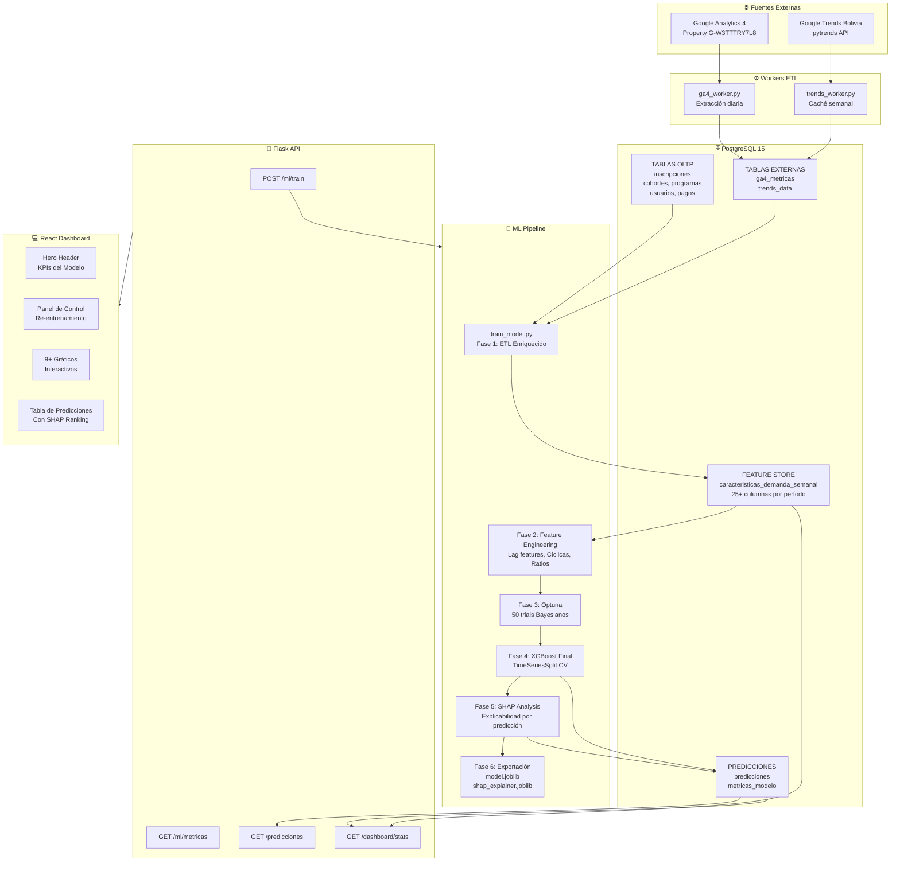

# Sistema Web Predictivo Basado en XGBoost y Explicabilidad SHAP
## Módulo de Inteligencia Artificial — Documentación Técnica

**Academia Autopoiesis Certum Software**  
**Versión:** 2.0 — Arquitectura Profesional  
**Fecha:** Mayo 2026  
**Autor:** Módulo de IA — Sistema Autopoiesis

---

## Tabla de Contenidos

1. [Resumen Ejecutivo](#1-resumen-ejecutivo)
2. [Arquitectura General del Sistema](#2-arquitectura-general-del-sistema)
3. [Ecosistema de Datos: Fuentes y Flujo](#3-ecosistema-de-datos-fuentes-y-flujo)
4. [Base de Datos: Diseño del Feature Store](#4-base-de-datos-diseño-del-feature-store)
5. [Pipeline ETL: Extracción y Preprocesamiento](#5-pipeline-etl-extracción-y-preprocesamiento)
6. [Ingeniería de Features: Las 25+ Variables del Modelo](#6-ingeniería-de-features-las-25-variables-del-modelo)
7. [Modelo Predictivo: XGBoost Optimizado](#7-modelo-predictivo-xgboost-optimizado)
8. [Ajuste de Hiperparámetros con Optuna](#8-ajuste-de-hiperparámetros-con-optuna)
9. [Métricas de Evaluación y Validación](#9-métricas-de-evaluación-y-validación)
10. [Explicabilidad SHAP: Interpretación de Decisiones](#10-explicabilidad-shap-interpretación-de-decisiones)
11. [Integración de Datos Externos: GA4 y Google Trends](#11-integración-de-datos-externos-ga4-y-google-trends)
12. [API REST: Endpoints del Módulo IA](#12-api-rest-endpoints-del-módulo-ia)
13. [Dashboard Predictivo: Guía de Uso para el Administrador](#13-dashboard-predictivo-guía-de-uso-para-el-administrador)
14. [Ciclo de Vida del Modelo: Re-entrenamiento y Versionado](#14-ciclo-de-vida-del-modelo-re-entrenamiento-y-versionado)
15. [Comandos de Operación Docker](#15-comandos-de-operación-docker)
16. [Glosario Técnico](#16-glosario-técnico)

---

## 1. Resumen Ejecutivo

El **Sistema Predictivo Autopoiesis** es un módulo de inteligencia artificial diseñado para asistir a los administradores académicos en la **estimación de la demanda de cursos y diplomados**. A diferencia de un simple contador de inscripciones, el sistema procesa el **ecosistema completo de datos de la academia** — desde el historial transaccional interno hasta señales externas de mercado (Google Analytics 4 y Google Trends Bolivia) — para generar predicciones accionables con plena transparencia algorítmica.

### ¿Qué hace el sistema?

El módulo responde a preguntas concretas del administrador:
- **"¿Debo lanzar el Diplomado en Derecho Laboral este trimestre?"**  
  → El sistema predice la demanda esperada para las próximas 20 semanas, con intervalos de confianza y el factor más influyente en la predicción (ej: "La temporada actual históricamente genera +40% más inscripciones en esta categoría").

- **"¿Qué factores están impulsando o frenando las inscripciones?"**  
  → El módulo SHAP descompone cada predicción en la contribución cuantificada de cada variable, eliminando la "caja negra" del modelo.

- **"¿El interés en redes coincide con la demanda real?"**  
  → Los datos de GA4 y Google Trends Bolivia se correlacionan visualmente con las inscripciones históricas.

### Principio de Diseño

> *"La demanda no es un número aislado, sino un conjunto de métricas accionables."*

El sistema no entrega un solo número, sino un conjunto de indicadores que el administrador puede interpretar en contexto: predicción puntual, intervalo de confianza, nivel de riesgo, canal de captación más efectivo, perfil demográfico proyectado y recomendación textual.

---

## 2. Arquitectura General del Sistema



### Capas de la Arquitectura

| Capa | Tecnología | Responsabilidad |
|------|-----------|----------------|
| **Datos Internos** | PostgreSQL 15 | Fuente de verdad transaccional (OLTP) |
| **Datos Externos** | GA4 Data API + pytrends | Señales de mercado y comportamiento web |
| **Feature Store** | PostgreSQL (tabla `caracteristicas_demanda_semanal`) | Almacén centralizado de features ML calculados |
| **ML Engine** | XGBoost 2.0.3 + Optuna 3.6 + SHAP 0.45 | Entrenamiento, optimización y explicabilidad |
| **API** | Flask 3.0 + SQLAlchemy 2.0 | Exposición de predicciones y control de modelos |
| **UI** | React 18 + Recharts | Visualización y toma de decisiones |
| **Infraestructura** | Docker Compose | Orquestación de contenedores |

---

## 3. Ecosistema de Datos: Fuentes y Flujo

### 3.1 Datos Internos (OLTP)

La base de datos interna captura el **ciclo de vida completo del estudiante**:

```
Visitante Web → Suscriptor (boletin_informativo)
                          ↓
             Estudiante Registrado (usuarios)
                          ↓
             Inscripción (inscripciones)
                          ↓
         [Activo] → [Finalizado] → [Certificado]
         [Retirado]
```

Las tablas utilizadas por el modelo y su aportación en features:

| Tabla | Features derivados |
|-------|-------------------|
| `inscripciones` | Target (conteo_demanda), ingresos, tasa de descuento |
| `usuarios` | Edad promedio/mediana/min/max, distribución grados, distribución departamentos |
| `programas` | Costo oficial, duración, categoría, tipo, modalidad |
| `cohortes` | Temporalidad de las inscripciones |
| `estados_inscripcion` | Tasas de retención/abandono/finalización |
| `origenes_captacion` | Distribución de canales (Facebook, boletín, orgánico) |
| `programa_facilitadores` | Número de facilitadores por programa |
| `programa_beneficios` | Número de beneficios por programa |
| `pagos` | Monto real pagado vs. costo oficial (tasa de descuento) |

### 3.2 Datos Externos

#### Google Analytics 4 (GA4)
- **Property:** `G-W3TTTRY7L8` (ya configurado en el frontend)
- **Extracción:** `ga4_worker.py` via Google Analytics Data API v1
- **Métricas capturadas:** `sessions`, `activeUsers`, `conversions`, `eventCount`, `bounceRate`
- **Dimensiones:** fecha, `pagePath` (para mapear vistas de `/programa/{id}` → `programa_id`)
- **Frecuencia:** Diaria (últimos 90 días en cada ejecución)
- **Tabla destino:** `ga4_metricas`

#### Google Trends Bolivia
- **Herramienta:** `pytrends` (scraping de trends.google.com)
- **Geografía:** `geo='BO'` (Bolivia)
- **Keywords por categoría académica:**

| Categoría | Keywords de búsqueda |
|-----------|---------------------|
| Derecho | "curso derecho Bolivia", "diplomado derecho La Paz" |
| Psicología | "curso psicologia Bolivia", "psicologia clinica Bolivia" |
| Investigación | "metodologia investigacion Bolivia", "tesis Bolivia" |
| Educación | "pedagogia Bolivia", "diplomado educacion" |
| Salud | "salud publica Bolivia", "nutricion Bolivia" |
| Tecnología | "programacion Bolivia", "curso tecnologia Bolivia" |
| Administración | "administracion empresas Bolivia", "gestion publica Bolivia" |

- **Período:** 104 semanas (2 años de historial)
- **Tabla destino:** `trends_data` (índice 0-100 por semana)
- **Cache:** No se re-ejecuta si el dato tiene < 7 días

---

## 4. Base de Datos: Diseño del Feature Store

### 4.1 `caracteristicas_demanda_semanal` — La Pieza Central

Esta tabla es el **Feature Store** del sistema: una vista materializada calculada que almacena todas las variables de entrada del modelo en formato listo para XGBoost.

**Filosofía de diseño:** En lugar de recalcular features en cada entrenamiento (costoso y no reproducible), los features se calculan una vez por el pipeline ETL y se persisten. Esto permite:
1. Auditar exactamente qué datos vio el modelo.
2. Re-entrenar con diferentes configuraciones sin re-procesar los datos crudos.
3. Servir features en tiempo real para predicción sin queries complejas.

**Granularidad:** Un registro por `(programa_id, año, semana_del_año)`.

```sql
-- 25+ columnas por fila: (programa_id=1, anio=2024, semana=15)
-- conteo_demanda = 8 inscripciones
-- edad_promedio = 27.3 años
-- porc_profesionales = 0.625 (62.5% son profesionales)
-- porc_facebook = 0.375 (37.5% vinieron de Facebook)
-- conteo_lag_1 = 6 (semana anterior tuvo 6 inscripciones)
-- trends_interes_categoria = 78 (índice de búsqueda alto esa semana)
-- ... etc.
```

### 4.2 `predicciones` — Enriquecida para el Dashboard

```sql
-- Ejemplo de fila de predicción futura:
-- programa_id=1, semana_objetivo=20, anio_objetivo=2024
-- demanda_predicha = 9.4
-- demanda_lower = 6.1 (IC 90% inferior)
-- demanda_upper = 13.2 (IC 90% superior)
-- nivel_confianza = 0.87
-- top_feature_nombre = 'conteo_lag_1'
-- recomendacion = 'Alta demanda proyectada. Lanzamiento recomendado...'
-- nivel_riesgo = 'bajo'
-- shap_ranking = [{"feature": "conteo_lag_1", "impact": 2.34}, ...]
```

### 4.3 `metricas_modelo` — Auditoría del Modelo

Cada re-entrenamiento genera un nuevo registro con las métricas completas. El campo `activo=true` identifica el modelo en producción. Esto permite comparar versiones y revertir si el nuevo modelo es peor.

---

## 5. Pipeline ETL: Extracción y Preprocesamiento

### 5.1 Flujo del Pipeline (train_model.py)

```
┌──────────────────────────────────────────────────────────┐
│ FASE 1: ETL — Construcción del Feature Store             │
│                                                          │
│ SELECT * FROM inscripciones                              │
│   JOIN cohortes, programas, usuarios                     │
│   JOIN estados_inscripcion, origenes_captacion           │
│   JOIN grados_academicos, departamentos                  │
│   JOIN programa_facilitadores, programa_beneficios       │
│                                                          │
│ GROUP BY (programa_id, año, semana)                      │
│   → conteo_demanda (TARGET)                              │
│   → 8 features demográficos                              │
│   → 4 features financieros                               │
│   → 4 features de retención                             │
│   → 4 features de canal                                  │
│   → 7 features del programa                             │
│   → 6 features temporales                                │
│                                                          │
│ MERGE con ga4_metricas (4 features GA4)                  │
│ MERGE con trends_data (2 features Trends)               │
│                                                          │
│ COMPUTE LAG FEATURES por programa_id:                    │
│   → lag_1, lag_2, lag_4, rolling_4w, rolling_8w          │
│   → mismo_periodo_anio_anterior                          │
│                                                          │
│ UPSERT → caracteristicas_demanda_semanal                 │
└──────────────────────────────────────────────────────────┘
         ↓
┌──────────────────────────────────────────────────────────┐
│ FASE 2: EDA Automatizado                                  │
│   - Estadísticas descriptivas del target                  │
│   - Distribución de nulos por feature                    │
│   - Correlaciones con target (Spearman)                  │
│   - Detección de outliers (IQR)                          │
└──────────────────────────────────────────────────────────┘
         ↓
┌──────────────────────────────────────────────────────────┐
│ FASE 3: Preprocesamiento                                  │
│   - Imputación de nulos: mediana por grupo (programa_id)  │
│   - Clip valores negativos → 0                           │
│   - Sin scaling (XGBoost es invariante a escala)         │
└──────────────────────────────────────────────────────────┘
         ↓
┌──────────────────────────────────────────────────────────┐
│ FASE 4: Train/Test Split Temporal                         │
│   - Ordenar por anio, semana_del_anio                    │
│   - 80% más antiguo → X_train, y_train                   │
│   - 20% más reciente → X_test, y_test                    │
│   ⚠️ NO se usa random shuffle (evita data leakage)        │
└──────────────────────────────────────────────────────────┘
         ↓
┌──────────────────────────────────────────────────────────┐
│ FASE 5: Optuna (50 trials Bayesianos)                    │
│   - Objetivo: minimizar RMSE en TimeSeriesSplit(5 folds)  │
│   - Espacio de búsqueda: 9 hiperparámetros               │
│   - Early stopping: 50 rounds sin mejora                  │
└──────────────────────────────────────────────────────────┘
         ↓
┌──────────────────────────────────────────────────────────┐
│ FASE 6: Entrenamiento Final + Evaluación                  │
│   - XGBoostRegressor con mejores hiperparámetros          │
│   - Métricas: RMSE, MAE, R², MAPE en train y test        │
│   - Exportación: model.joblib + shap_explainer.joblib    │
│   - Registro en metricas_modelo                          │
└──────────────────────────────────────────────────────────┘
         ↓
┌──────────────────────────────────────────────────────────┐
│ FASE 7: Generación de Predicciones                        │
│   - Históricas: re-predecir puntos conocidos             │
│   - Futuras: proyectar 20 semanas desde hoy              │
│   - Bootstrap IC 90% (n=50 sub-muestras)                 │
│   - SHAP values + ranking por predicción                 │
│   - Recomendación textual + nivel_riesgo                  │
│   - UPSERT → predicciones                                │
└──────────────────────────────────────────────────────────┘
```

### 5.2 Manejo de Datos Faltantes

| Situación | Estrategia |
|-----------|-----------|
| GA4 sin datos | Features GA4 = 0 (modelo aprende sin ellos hasta sincronizar) |
| Trends sin datos | Features Trends = 0 (idem) |
| Nulos en demográficos | Mediana del grupo (programa_id), no mediana global |
| Programa nuevo (sin historial) | Lag features = 0, modelo usa solo features estáticos del programa |
| Semana sin inscripciones | No se genera fila (target implícitamente = 0 para lag features) |

---

## 6. Ingeniería de Features: Las 25+ Variables del Modelo

### 6.1 Categorías de Features

#### 🧬 Demográficos (8 features)
Capturan el **perfil del estudiantado** que ha demandado el programa históricamente.

| Feature | Tipo | Descripción |
|---------|------|-------------|
| `edad_promedio` | Continuo | Edad media de inscritos esa semana |
| `edad_mediana` | Continuo | Mediana (más robusta a outliers) |
| `edad_min` / `edad_max` | Continuo | Rango etario |
| `porc_estudiantes` | Ratio [0,1] | % con grado 'Estudiante' |
| `porc_profesionales` | Ratio [0,1] | % con grado 'Profesional' |
| `porc_la_paz` | Ratio [0,1] | % del departamento La Paz |
| `porc_otros_depts` | Ratio [0,1] | % de otros departamentos |

**Aporte ML:** El modelo puede aprender que, por ejemplo, los diplomados de alto costo atraen más profesionales, y que la demanda de La Paz es más estable que la provincial.

#### 💰 Financieros (4 features)
Relacionan el precio del programa con el comportamiento de compra.

| Feature | Tipo | Descripción |
|---------|------|-------------|
| `ingreso_semana` | Continuo (Bs) | Suma de `costo_pagado` esa semana |
| `precio_promedio_pagado` | Continuo (Bs) | Precio real pagado |
| `tasa_descuento` | Ratio [0,1] | (oficial - pagado) / oficial |
| `precio_relativo` | Ratio | Precio del programa / promedio de su categoría |

**Aporte ML:** Un `precio_relativo` alto puede indicar que el programa está sobrevalorado respecto a la competencia interna, impactando negativamente la demanda.

#### 🔄 Retención y Embudo (4 features)
Miden la calidad de la experiencia académica como predictor de la demanda futura.

| Feature | Tipo | Descripción |
|---------|------|-------------|
| `tasa_activos` | Ratio [0,1] | % de inscritos actualmente activos |
| `tasa_retirados` | Ratio [0,1] | % que se retiraron |
| `tasa_finalizados` | Ratio [0,1] | % que completaron el programa |
| `tasa_pendientes` | Ratio [0,1] | % pendientes de pago |

**Aporte ML:** Una alta `tasa_retirados` histórica es una señal negativa que el modelo aprende a penalizar en la proyección de demanda futura.

#### 📢 Canales de Captación (4 features)
Indican qué canal de marketing es más efectivo para cada programa.

| Feature | Tipo | Descripción |
|---------|------|-------------|
| `porc_facebook` | Ratio [0,1] | % que llegaron por Facebook Ads |
| `porc_boletin` | Ratio [0,1] | % por boletín informativo |
| `porc_organico` | Ratio [0,1] | % por búsqueda orgánica (SEO) |
| `porc_recomendacion` | Ratio [0,1] | % por boca a boca |

**Aporte ML:** Si un programa depende en >70% de Facebook y el presupuesto publicitario baja, el modelo puede reflejar ese riesgo en la proyección.

#### 📚 Atributos del Programa (7 features)
Características estructurales que diferencian cada programa.

| Feature | Tipo | Descripción |
|---------|------|-------------|
| `duracion_horas` | Entero | Horas totales del programa |
| `num_facilitadores` | Entero | Cantidad de facilitadores asignados |
| `costo_oficial_bs` | Continuo (Bs) | Precio oficial del programa |
| `categoria_id` | Entero (1-7) | Categoría temática |
| `tipo_servicio_id` | Binario (1,2) | 1=Curso, 2=Diplomado |
| `modalidad_id` | Entero (1-3) | 1=Virtual, 2=Presencial, 3=Híbrido |
| `num_beneficios` | Entero | Cantidad de beneficios ofrecidos |

#### 📅 Temporales Cíclicos (6 features)
Codifican la estacionalidad sin introducir discontinuidades artificiales.

| Feature | Fórmula | Descripción |
|---------|---------|-------------|
| `seno_semana` | sin(2π × semana / 52) | Componente cíclica semanal |
| `coseno_semana` | cos(2π × semana / 52) | Componente cíclica semanal |
| `seno_mes` | sin(2π × mes / 12) | Componente cíclica mensual |
| `coseno_mes` | cos(2π × mes / 12) | Componente cíclica mensual |
| `es_inicio_trimestre` | bool | Semanas 1, 13, 26, 39 |
| `es_fin_anio` | bool | Semanas 50-52 |

> **Fundamento:** Si usáramos `semana_del_anio` como entero (1-52), el modelo vería la semana 52 y la semana 1 como extremos opuestos, cuando en realidad son consecutivas. La codificación seno/coseno preserva la continuidad temporal.

#### 🌐 Features Externos GA4 (4 features)
Señales de comportamiento digital correlacionadas con la intención de compra.

| Feature | Fuente | Descripción |
|---------|--------|-------------|
| `ga4_sesiones_semana` | GA4 sessions | Visitas totales al sitio esa semana |
| `ga4_eventos_conversion` | GA4 conversions | Eventos de conversión registrados |
| `ga4_usuarios_activos` | GA4 activeUsers | Usuarios únicos activos |
| `ga4_tasa_rebote` | GA4 bounceRate | Tasa de rebote (inverse de engagement) |

#### 🔍 Features Externos Trends (2 features)
Proxy del interés de mercado en el tema del programa.

| Feature | Fuente | Descripción |
|---------|--------|-------------|
| `trends_interes_categoria` | Google Trends | Índice 0-100 para la categoría del programa |
| `trends_interes_programa` | Google Trends | Índice 0-100 para keywords específicas |

#### ⏳ Lag Features (6 features — los más poderosos)
Capturan la **autocorrelación temporal** de la demanda.

| Feature | Descripción |
|---------|-------------|
| `conteo_lag_1` | Demanda de la semana anterior (mismo programa) |
| `conteo_lag_2` | Demanda de hace 2 semanas |
| `conteo_lag_4` | Demanda de hace 4 semanas (~1 mes) |
| `conteo_rolling_4w` | Promedio móvil de 4 semanas |
| `conteo_rolling_8w` | Promedio móvil de 8 semanas |
| `conteo_mismo_periodo_anio_ant` | Demanda en la misma semana del año anterior |

> **¿Por qué son tan importantes?** Los lag features suelen ser los de mayor SHAP value en series temporales. El principio es: *la mejor predicción de la demanda de la próxima semana es lo que pasó la semana pasada y la semana pasada del año anterior*.

---

## 7. Modelo Predictivo: XGBoost Optimizado

### 7.1 ¿Por qué XGBoost?

XGBoost (Extreme Gradient Boosting) es un algoritmo de **ensamble de árboles de decisión** que construye el modelo de forma iterativa, donde cada árbol corrige los errores del anterior (Gradient Boosting). Sus ventajas para este caso de uso:

| Ventaja | Relevancia para Autopoiesis |
|---------|----------------------------|
| **Manejo nativo de nulos** | Programas nuevos sin historial completo |
| **Invariante a escala** | No requiere normalizar features de diferentes magnitudes |
| **Regularización L1/L2** | Evita overfitting con pocos datos por programa |
| **Feature importance nativa** | Complementa y valida el análisis SHAP |
| **Velocidad de entrenamiento** | Re-entrenamiento semanal viable en Docker |
| **Compatibilidad con SHAP** | TreeExplainer es exacto (no aproximado) con XGBoost |

### 7.2 Arquitectura del Modelo

El modelo es un **regresor global** entrenado sobre todos los programas simultáneamente, con `programa_id` como feature categórico. Esta decisión arquitectónica es fundamental:

**Modelo Global vs. Por Programa:**
- **Global:** Un solo modelo aprende patrones compartidos (estacionalidad, demografía) y diferencias específicas de programa. Requiere menos datos por programa. ✅ **Elegido**
- **Por programa:** Un modelo por programa. Requiere historial abundante por programa (>100 puntos por programa). ❌ Inviable con ~3000 inscripciones distribuidas en 10+ programas.

### 7.3 Objetivo de Regresión

- **Variable objetivo (target):** `conteo_demanda` — número de inscripciones nuevas por semana y programa
- **Función de pérdida:** `reg:squarederror` (RMSE)
- **Tipo:** Regresión (no clasificación) — la demanda es continua

### 7.4 Prevención de Data Leakage

El data leakage ocurre cuando el modelo ve información del futuro durante el entrenamiento, generando un accuracy artificialmente inflado. El sistema implementa tres capas de protección:

1. **Split temporal cronológico:** El 20% más reciente de datos va al test set — el modelo nunca ve el futuro durante el entrenamiento.
2. **TimeSeriesSplit en Optuna:** La validación cruzada respeta el orden temporal, nunca usando datos futuros para validar.
3. **Lag features calculados antes del split:** Los lag features se calculan sobre la serie completa ordenada, luego se corta — nunca se calcula el lag usando datos del test.

---

## 8. Ajuste de Hiperparámetros con Optuna

### 8.1 ¿Qué es la Optimización Bayesiana?

A diferencia de Grid Search (que prueba todas las combinaciones) o Random Search (que prueba aleatoriamente), **Optuna implementa búsqueda bayesiana**: aprende de los trials anteriores qué regiones del espacio de hiperparámetros son prometedoras y los explora inteligentemente.

```
Trial 1: n_estimators=300, max_depth=5 → RMSE=2.1
Trial 2: n_estimators=500, max_depth=3 → RMSE=1.8
...
Trial 50: n_estimators=420, max_depth=4 → RMSE=1.3  ← mejor
```

Con 50 trials, Optuna explora eficientemente un espacio que Grid Search requeriría miles de combinaciones para cubrir.

### 8.2 Espacio de Búsqueda

| Hiperparámetro | Rango | Efecto |
|----------------|-------|--------|
| `n_estimators` | [100, 1000] | Más árboles = más capacidad, pero más riesgo de overfitting |
| `max_depth` | [3, 10] | Profundidad del árbol. Más profundo = más complejo |
| `learning_rate` | [0.005, 0.3] (log) | Tasa de aprendizaje. Menor = más estable, más lento |
| `subsample` | [0.5, 1.0] | Fracción de datos por árbol. Reduce overfitting |
| `colsample_bytree` | [0.5, 1.0] | Fracción de features por árbol |
| `min_child_weight` | [1, 15] | Mínimo de observaciones por hoja |
| `reg_alpha` | [0, 5] | Regularización L1 (lasso) |
| `reg_lambda` | [0, 5] | Regularización L2 (ridge) |
| `gamma` | [0, 2] | Umbral mínimo de ganancia para hacer un split |

### 8.3 Early Stopping

Para cada trial en Optuna, el entrenamiento usa `early_stopping_rounds=50`: si el modelo no mejora en 50 iteraciones consecutivas sobre el validation set, se detiene. Esto acelera dramáticamente el proceso de búsqueda sin sacrificar calidad.

---

## 9. Métricas de Evaluación y Validación

### 9.1 Métricas Implementadas

| Métrica | Fórmula | Interpretación para Autopoiesis |
|---------|---------|--------------------------------|
| **RMSE** | √(Σ(y_pred - y_real)²/n) | Error promedio en unidades de inscripciones. RMSE=2.1 significa el modelo se equivoca ~2 inscripciones |
| **MAE** | Σ\|y_pred - y_real\|/n | Error absoluto medio. Más robusto a outliers que RMSE |
| **R²** | 1 - SS_res/SS_tot | % de varianza explicada. R²=0.85 → el modelo explica el 85% de la variación en demanda |
| **MAPE** | Σ\|y_pred-y_real\|/y_real × 100 | Error porcentual medio. MAPE=15% → predicciones tienen 15% de error en promedio |

### 9.2 Interpretación para el Administrador

| R² | Interpretación | Acción recomendada |
|----|---------------|-------------------|
| > 0.85 | ✅ Excelente | Las predicciones son confiables para tomar decisiones |
| 0.70 - 0.85 | 🟡 Bueno | Usar predicciones con margen de cautela |
| 0.50 - 0.70 | 🟠 Aceptable | Validar con juicio experto antes de decidir |
| < 0.50 | 🔴 Bajo | Re-entrenar con más datos o revisar calidad del feature store |

### 9.3 Intervalos de Confianza Bootstrap

El sistema calcula intervalos de confianza del 90% para cada predicción futura mediante **Bootstrap**:
1. Se re-muestrean n=50 subconjuntos del 80% del training data.
2. Se entrena el modelo en cada subconjunto.
3. Se predicen las semanas futuras con cada modelo.
4. El IC 90% es el percentil 5 y 95 de las 50 predicciones.

`nivel_confianza = 1 - (std_predicciones / mean_predicciones)` — valores cercanos a 1 indican predicciones estables entre sub-muestras.

---

## 10. Explicabilidad SHAP: Interpretación de Decisiones

### 10.1 ¿Qué es SHAP?

SHAP (SHapley Additive exPlanations) es un framework matemático basado en la **Teoría de Juegos Cooperativos** (Shapley, 1953) que responde la pregunta: *¿cuánto contribuyó cada feature a esta predicción específica?*

**Propiedad clave — Aditividad:** Para cada predicción:
```
prediccion = valor_base + SHAP(lag_1) + SHAP(semana) + SHAP(trends) + ... + SHAP(edad)
```
Donde `valor_base` es la predicción promedio del modelo (sin conocer ningún feature), y cada `SHAP(feature)` es la contribución positiva o negativa de ese feature.

### 10.2 TreeExplainer: Exacto, No Aproximado

Para modelos de árbol (XGBoost, LightGBM, Random Forest), SHAP usa `TreeExplainer`, que calcula los valores SHAP **exactos** en O(TLD²) donde T=árboles, L=hojas, D=profundidad. No usa aproximaciones de Monte Carlo. Esto garantiza explicaciones deterministas y reproducibles.

### 10.3 Interpretación de los SHAP Values

**Ejemplo para el Diplomado en Derecho Laboral, Semana 20/2024:**

| Feature | Valor actual | SHAP | Interpretación |
|---------|-------------|------|---------------|
| `conteo_lag_1` | 12 | +3.2 | La demanda alta de la semana pasada impulsa la predicción al alza |
| `trends_interes_categoria` | 78 | +1.8 | Alto interés en búsquedas de "derecho Bolivia" esta semana |
| `es_inicio_trimestre` | TRUE | +1.4 | Los inicios de trimestre históricamente tienen más demanda |
| `tasa_retirados` | 0.05 | +0.8 | Baja tasa de abandono genera confianza en el programa |
| `porc_facebook` | 0.6 | -0.9 | Alta dependencia de Facebook es un factor de riesgo |
| **Predicción total** | | **9.4** | valor_base (5.1) + suma de SHAPs |

**Para el administrador, esto significa:**
> *"La predicción de 9 inscripciones para la semana 20 se debe principalmente a que el programa tuvo alta demanda la semana pasada y el interés en Google sobre derecho está en un pico. El único factor negativo es la alta dependencia del canal Facebook."*

### 10.4 SHAP Global: Importancia de Features

El dashboard muestra el **promedio del valor absoluto SHAP por feature** sobre todas las predicciones, que responde: *¿qué features impactan más al modelo en general?* Esto orienta al administrador sobre dónde invertir para mejorar la demanda:

- Si `trends_interes_categoria` tiene SHAP alto → invertir en SEO y contenido de valor
- Si `porc_facebook` tiene SHAP alto → el canal de redes sociales es clave
- Si `tasa_retirados` tiene SHAP alto → la retención es un predictor fuerte de demanda futura

---

## 11. Integración de Datos Externos: GA4 y Google Trends

### 11.1 Configuración de GA4

#### Pasos para activar la integración:

1. **Google Cloud Console** → Ir a [console.cloud.google.com](https://console.cloud.google.com)
2. **Crear/seleccionar proyecto** → Asociar al proyecto Autopoiesis
3. **APIs y Servicios** → Biblioteca → Buscar "Google Analytics Data API" → Habilitar
4. **Credenciales** → Crear Credencial → Cuenta de servicio → Descargar JSON
5. **Google Analytics** → Admin → Property Access Management → Agregar el correo de la service account con rol "Viewer"
6. **Colocar el JSON** en `backend/data/ga4_credentials.json`
7. **Variable de entorno en docker-compose.yml:**
   ```yaml
   environment:
     GA4_PROPERTY_ID: "XXXXXXXXX"  # El ID numérico de la property (no el G-...)
   ```

#### Modo degradado:
Si el archivo de credenciales no existe, `ga4_worker.py` registra una advertencia y los features GA4 permanecen en 0. El modelo sigue funcionando con los datos internos.

### 11.2 Cómo Google Trends Aporta al Modelo

El índice de Google Trends (0-100) mide el **interés relativo de búsqueda**, no el volumen absoluto. Es un proxy de la intención de búsqueda:

- Semana con índice 100: máximo interés histórico en esa keyword
- Semana con índice 50: la mitad del interés máximo
- Semana con índice 0: sin búsquedas relevantes

**Hipótesis del modelo:** Un pico de búsquedas en "curso derecho Bolivia" anticipa un incremento en inscripciones 1-2 semanas después. El lag entre el interés web y la conversión varía por programa y es aprendido automáticamente por XGBoost.

---

## 12. API REST: Endpoints del Módulo IA

| Método | Endpoint | Auth | Descripción |
|--------|----------|------|-------------|
| `GET` | `/api/admin/dashboard/stats` | Admin | Dashboard completo con todos los charts |
| `POST` | `/api/admin/ml/train` | Admin | Lanza re-entrenamiento en background |
| `GET` | `/api/admin/ml/status` | Admin | Estado del entrenamiento en curso |
| `GET` | `/api/admin/ml/metricas` | Admin | Métricas del modelo activo |
| `GET` | `/api/admin/predicciones` | Admin | Predicciones futuras con SHAP detallado |
| `POST` | `/api/admin/ml/ga4-sync` | Admin | Sincroniza datos GA4 manualmente |
| `POST` | `/api/admin/ml/trends-sync` | Admin | Sincroniza Google Trends manualmente |

### Ejemplo de respuesta `/api/admin/ml/metricas`:
```json
{
  "success": true,
  "data": {
    "version": 3,
    "fecha_entrenamiento": "2024-05-20T10:30:00Z",
    "rmse_train": 0.89,
    "rmse_test": 1.23,
    "mae_test": 0.91,
    "r2_test": 0.87,
    "mape_test": 14.2,
    "n_samples_train": 2400,
    "n_samples_test": 600,
    "n_features": 25,
    "n_optuna_trials": 50,
    "mejores_hiperparametros": {
      "n_estimators": 420,
      "max_depth": 5,
      "learning_rate": 0.05
    },
    "importancia_features": [
      {"feature": "conteo_lag_1", "importance": 0.342},
      {"feature": "trends_interes_categoria", "importance": 0.189}
    ]
  }
}
```

---

## 13. Dashboard Predictivo: Guía de Uso para el Administrador

### 13.1 Secciones del Dashboard

#### 🏠 Hero Header
Muestra el estado del modelo en tiempo real: fecha del último entrenamiento, R² del modelo (barra de color), y el badge "XGBoost + SHAP Activo".

**¿Qué hacer si el badge está gris?** El modelo no se ha entrenado aún. Haz clic en "🚀 Re-entrenar Modelo" en el Panel de Control.

#### ⚙️ Panel de Control de Re-entrenamiento
Botón para disparar el re-entrenamiento desde la interfaz. El proceso tarda entre 2-10 minutos dependiendo del volumen de datos. Se muestra el progreso en tiempo real.

**¿Cuándo re-entrenar?**
- Al menos cada 2-4 semanas
- Después de cargar nuevas inscripciones masivas
- Cuando el R² baje del umbral amarillo (0.70)

#### 📈 Evolución Temporal
Gráfico de área que muestra la demanda histórica (línea sólida azul) vs. la proyección XGBoost (línea punteada roja). La línea vertical marca "Hoy" — todo lo que está a la derecha es predicción futura.

#### 🎯 Tabla de Predicciones Futuras
La herramienta más accionable del dashboard. Para cada programa y semana futura:
- **Demanda Predicha:** número esperado de inscripciones
- **IC [5% - 95%]:** rango de incertidumbre
- **Confianza:** qué tan consistente es la predicción (>0.8 = confiable)
- **Riesgo:** 🟢 Bajo / 🟡 Medio / 🔴 Alto
- **Factor Principal:** el feature SHAP más determinante en esa predicción
- **Recomendación:** texto accionable generado automáticamente

#### 🤖 Explicabilidad SHAP
Bar chart horizontal mostrando el impacto promedio de cada feature. Leer como: *"los features con barras más largas son los que más influyen en las predicciones del modelo"*.

#### 🌐 Inteligencia Externa (GA4 + Trends)
- **GA4:** correlación entre sesiones web y inscripciones reales
- **Trends:** interés de búsqueda por categoría en Bolivia — útil para identificar qué temas están "en tendencia"

### 13.2 Flujo de Decisión del Administrador

```
¿Debo lanzar un programa?
         ↓
Ver tabla de Predicciones → ¿Demanda predicha > umbral mínimo?
         ↓                              ↓
        SÍ                             NO
         ↓                              ↓
Revisar Factor Principal        Ver Tendencias Bolivia
¿El factor es favorable?        ¿Hay interés creciente?
         ↓                              ↓
Revisar IC: ¿es estrecho?      Considerar posponer o
¿Confianza > 0.80?             reforzar marketing
         ↓
Decisión con información completa
```

---

## 14. Ciclo de Vida del Modelo: Re-entrenamiento y Versionado

### 14.1 Versionado Automático

Cada ejecución de `train_model.py` incrementa el número de versión en `metricas_modelo`. El campo `activo` marca el modelo actual en producción. Si el nuevo modelo tiene métricas peores, el administrador puede revertir manualmente (contactando al equipo técnico).

### 14.2 Cuándo Re-entrenar

| Trigger | Descripción |
|---------|-------------|
| **Programado** | Cada 2-4 semanas automáticamente |
| **Manual** | Desde el dashboard tras cargar nuevos datos |
| **Por degradación** | Cuando el R² en producción baja significativamente |
| **Por nuevos programas** | Al agregar programas nuevos a la academia |

### 14.3 Comando de Re-entrenamiento Manual

```bash
docker exec -it xgboost-course-prediction-backend-1 python ml/train_model.py
```

O desde el dashboard: botón "🚀 Re-entrenar Modelo".

---

## 15. Comandos de Operación Docker

### Secuencia Inicial (Instalación Fresca)

```powershell
# 1. Clonar o asegurarse de estar en el directorio correcto
cd "c:\Users\pipe-\Repositorio Local\xgboost-course-prediction"

# 2. Construir y levantar todos los servicios
docker-compose up -d --build

# 3. Verificar que todos los servicios estén healthy
docker-compose ps

# 4. Cargar datos semilla y históricos
docker exec -it xgboost-course-prediction-backend-1 python import_data.py

# 5. Sincronizar Google Trends (no requiere credenciales)
docker exec -it xgboost-course-prediction-backend-1 python ml/trends_worker.py

# 6. Sincronizar GA4 (requiere ga4_credentials.json)
docker exec -it xgboost-course-prediction-backend-1 python ml/ga4_worker.py

# 7. Entrenar el modelo
docker exec -it xgboost-course-prediction-backend-1 python ml/train_model.py
```

### Secuencia de Actualización (Sistema Existente)

```powershell
# 1. Parar sin borrar datos
docker-compose down

# 2. Reconstruir con nuevas dependencias
docker-compose up -d --build

# 3. Re-entrenar con datos actuales
docker exec -it xgboost-course-prediction-backend-1 python ml/train_model.py
```

### Secuencia de Reset Completo (⚠️ Borra todos los datos)

```powershell
docker-compose down -v    # -v elimina el volumen postgres_data
docker-compose up -d --build
docker exec -it xgboost-course-prediction-backend-1 python import_data.py
docker exec -it xgboost-course-prediction-backend-1 python ml/train_model.py
```

### Verificar nombre exacto del contenedor

```powershell
docker ps --format "table {{.Names}}\t{{.Status}}"
```

---

## 16. Glosario Técnico

| Término | Definición |
|---------|-----------|
| **XGBoost** | Extreme Gradient Boosting. Algoritmo de ML basado en ensamble de árboles de decisión con optimización por gradiente |
| **SHAP** | SHapley Additive exPlanations. Framework para explicar predicciones de modelos ML basado en teoría de juegos |
| **Feature Store** | Base de datos central de features (variables de entrada) calculados y listos para entrenar/servir el modelo |
| **Feature Engineering** | Proceso de crear variables informativas a partir de datos crudos |
| **Lag Feature** | Variable que captura valores pasados de la serie temporal (ej: demanda de la semana anterior) |
| **Overfitting** | Cuando el modelo memoriza los datos de entrenamiento y falla en datos nuevos |
| **Data Leakage** | Error metodológico donde el modelo ve datos del futuro durante el entrenamiento, inflando artificialmente las métricas |
| **TimeSeriesSplit** | Validación cruzada que respeta el orden temporal de los datos |
| **Optuna** | Framework de optimización bayesiana para búsqueda de hiperparámetros |
| **Bootstrap** | Técnica estadística de re-muestreo para estimar intervalos de confianza |
| **Intervalo de Confianza** | Rango de valores dentro del cual se espera que caiga el valor real con cierta probabilidad |
| **RMSE** | Root Mean Square Error. Raíz del error cuadrático medio — mide el error en las mismas unidades del target |
| **MAE** | Mean Absolute Error. Error absoluto medio — más robusto a outliers que RMSE |
| **R²** | Coeficiente de determinación. Porcentaje de varianza del target explicado por el modelo (0-1) |
| **MAPE** | Mean Absolute Percentage Error. Error porcentual medio — más interpretable para comparar entre programas |
| **OLTP** | Online Transaction Processing. Sistema para gestionar transacciones en tiempo real (inscripciones, pagos) |
| **GA4** | Google Analytics 4. Plataforma de análisis web de Google |
| **pytrends** | Librería Python no oficial para acceder a datos de Google Trends |
| **TreeExplainer** | Implementación SHAP específica para modelos de árbol, exacta y eficiente |
| **Feature Importance** | Medida de cuánto contribuye cada feature a las predicciones del modelo en promedio |
| **joblib** | Librería Python para serialización eficiente de objetos Python (alternativa a pickle para arrays numpy grandes) |

---

*Documentación generada para el Sistema Web Predictivo Basado en XGBoost y Explicabilidad SHAP — Autopoiesis Certum Software*  
*Última actualización: Mayo 2026*
